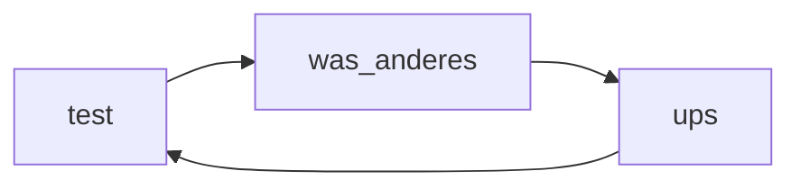

# Projekt


```mermaid
graph LR
    test --> was_anderes
    was_anderes --> ups
    ups --> test
```


## Zweite Überschrift

- eins
- zwei
- ....


| h1  | h2  |
| --- | --- |
| x   | y   |
| 1   | 3   |

````bash
ls -al
````


````java
public class XyZ {
    
}
````

