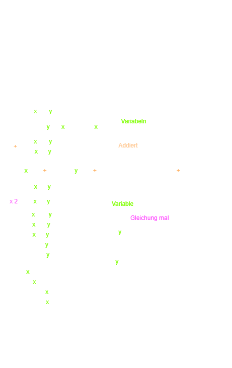
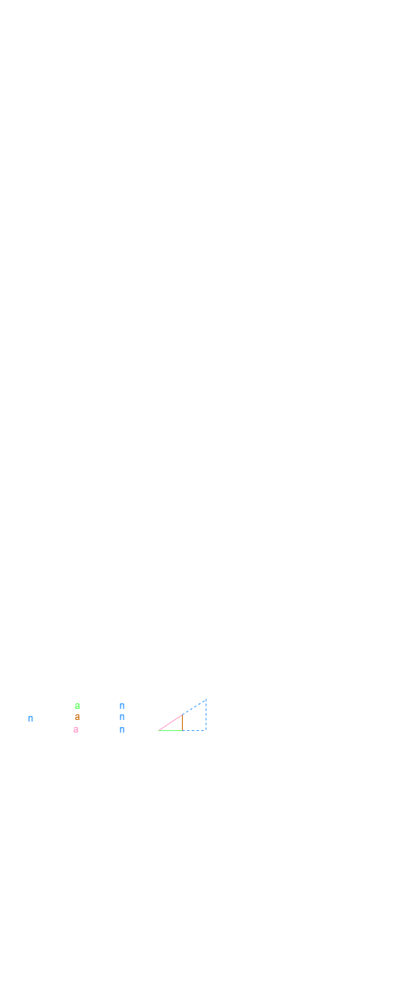
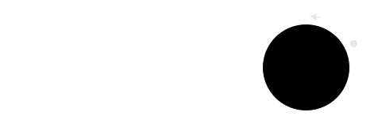
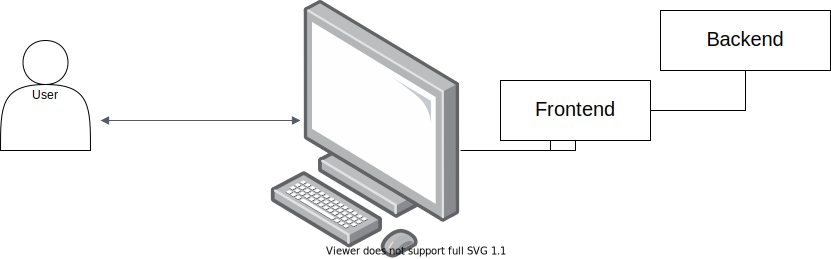
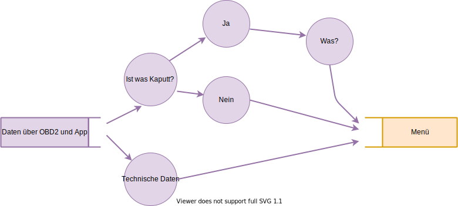
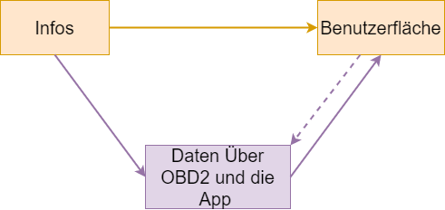
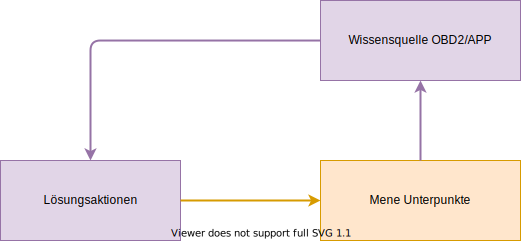
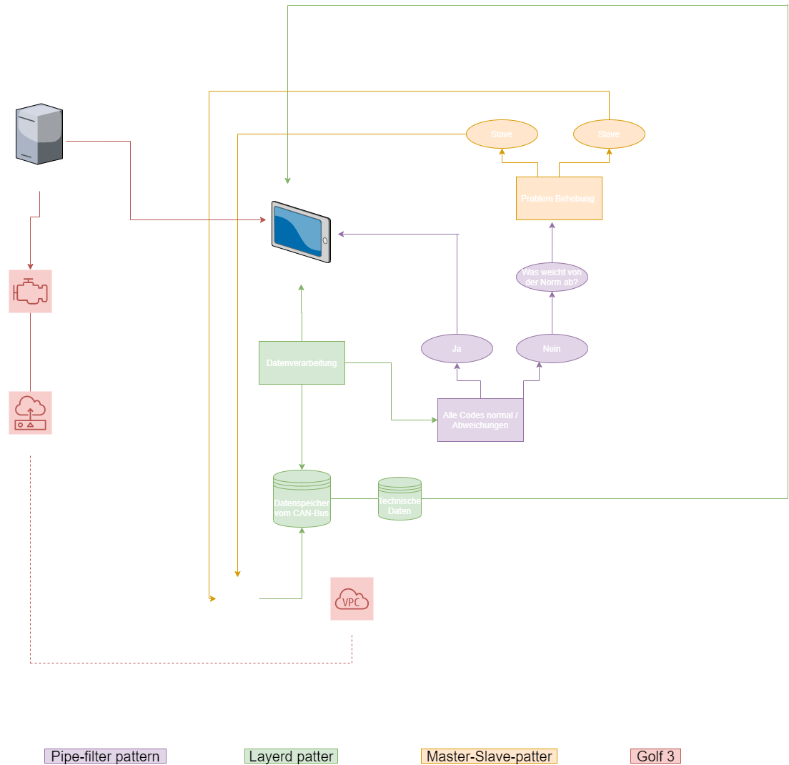
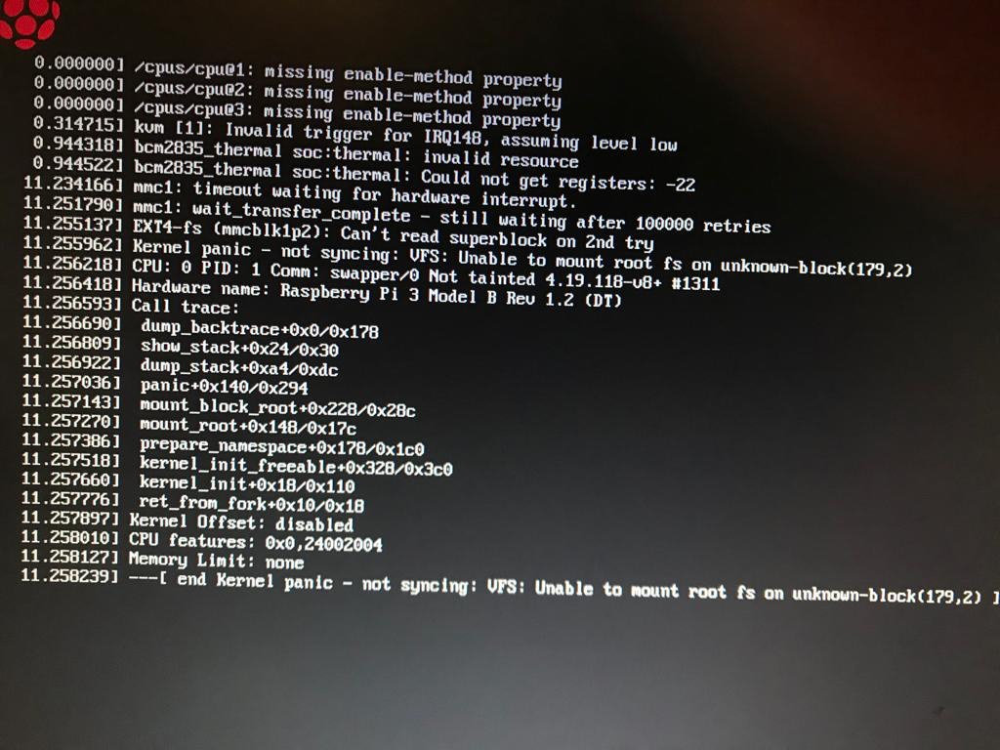

# Gulf 3 GT

Herzlich Willkommen auf meiner GitHub Seite.
Dies hier ist eine hälfte von meinem Projekt ein VW Golf 3 umzubauen. Dabei soll GitHub als eine Art Portfolie dienen, mit kleineren Ergänzungen, und Medium soll sich mit den Laufenden Prozesse befassen.
Selbstverständlich werden Sie auch hier änderungen finden, vorallem im Punkt Umbauten, Leistungstuning & Reperaturen.
Dort werden Sie auch eine Detailierte Erklärenung über das Projekt finden.
(Ps die Fotos sind hier für den Dark Mode gemacht). 

Gliederung:

## Mechatronik Grundlagen
### Mathematische und Physikalische Grundlagen
#### Algebra
#### Vektoren
#### Kinematik
## Informatik
### OBD 2
### Software Architektur
### Grundlagen Netzwerktechnik
## Raspberry Pi
## Software/APP Entwicklung
## Umbauten, Leistungstuning & Reperaturen

# Mathematische und Physikalische Grundlagen 
### Algebra 
Algebra -> Rechnung mit Unbekannten in Gleichungen 

### Vektoren

### Kinematik
Kinematik ist die Bewegungslehre von Körpern. Der Massepunkt (Masse / M) beschläunigt oder wird gebremst. Es gibt zwei Arten von Bewegungen.

1. Geradreaus (Translationsbewegungen)
2. Kreisbahn 

1a. Gradeaus: Translationsbewegungen

Translationsbewegungen eines Massepunktes m benötigt drei Größen: 

Ort des Massepunktes als Funktion der Zeit oder in einer gewissen Zeit zurückgelegten Strecke s

Geschwindigkeit v 

und im falle das sich die Geschwindigkeit ändert die Beschleuigung a.

Die Geschwindigkeit eines Massepunktes ist das Verhältnis des in einem gewissen Zeitinterfall /_\t zurückgelegten Weges /_\s zum Zeitintervall /_\t 

v=/_\s / /_\t

Die Änderung einer Geschwindigkeit nennt man Beschleunigung. DIese ist definiert als Änderung der Geschwindigkeit  /_\v in einem Zeitintervall /_\t:

a= /_\v / /_\t

Die Einheit der Beschleunigung ist m/s*2; wenn /_\v in dem Zeitintervall negativ ist, die Geschwindigkeit sich veringert, ist a negativ, und man spricht vom Bremsen.

VE-> Endgeschwindigkeit Vm-> Durchschnittsgeschwindigkeit

VE = at 

Vm = 1/2 at

s = Vmt = 1/2 at

/_\s = /_\v /_\t

/_\v = a /_\t

Luftwiederstand-> Fw= 1/2 cwPLAv*2

cw -> Luftwiderstandsbeiwert. ER Berücksichtigt die Form des Körpers und ist eine dimensionslose Zahl

PL -> Dichte der Luft. Je höher die Dichte der Luft desto größer ist der Wiederstand.

A -> Querschnitt des Körpers. Je Größer A desto höher der Wiederstand.

Ein Gegenstand hört auf zu Beschleuigen, wenn der Luftwiederstand genauso gr0ß ist wie die Geschwindigkeitskraft (mg). Dieser Zustand wird stationäre Fallgeschwindigkeit.

#### Energie- und Impulserhaltung

Der Impuls p einer sich bewegenden Masse ist definiert als das Produkt aus der Masse m und der Geschwindigkeit v:

p = mv

seine Einheit ist kg m/s

Die Kinetische Energie einer sich bewegenden Masse ist gegeben durch:

Ekin = 1/2 mc*2

Die Einheit der Energie ist kg m*2/s*2 oder Joul.
### Drehmoment und Kräfte     

# Informatik
## ODB
## Grundidee ODB2 Hobby
Technische Daten über mein KFZ-Sammeln, anschließend drauf Reagieren ggf. Reperieren. 
1. Den OBD2 Stecker anschließen und die Daten auf dem Handy speichern.
2. Durch ein selbstentwickelte Seite/Programm ein CAN-Bus anwenden um die Daten auszulesen. 
3. Seite/Programm mit einem, für mich benutzerfreundlichen, Oberfläche erstellen.
    
    3.1 Anwendung von Frontend und Backend
    
    Backend ist der Teil eines IT-Systems, das Datem im Hintergrund verarbeitet (datenverarbeitung). Um mit dem Backed zu agieren wird ein Frontend benötigt. 
    
    
 1. Verbesserung / Pflege / Reperatur wenn möglich vornehmen.
    ### 4.1 Zur Hilfe werden die Bücher Mechatronik und Maschienbau für Dummies 

## On-Board-Diagnose
Während der Fahrt werden alle abgasbeeinfussende Systeme überwacht. Als auch wichtige Steuergeräte.
Fehlercode -> DTC (Diagnostic Trouble Cod). 
Die Daten können mit einem CAN-Bus ausgelesen werden.
### Entprellung 
Falls ein Fehler passiert wird ein Entprellzähler gestartet. verschwindet der Fehler allerdings nicht, in der Entprellzeit, wird der Fehler in einem Fehler Speicher verschoben.
### Reading-Code 
Prüft ob alle abgasrelevante Bauteile / Einrichtungen durchs OBD geprüft wurden. Die Daten werden durch ein Scan-Tool ausgelesen.
### Nutzen 
Gefahrenabwehren und Schonung zum Beispiel kann ein Zylinder beim Kabelbruch vom Sprit zuspritzen ausgeschlossen werden. 

## CAN-Bus 
Controller Area Network (CAN)

Bus - Datenübertragungssystem 

Controller - Mini-Computer

Area - Bereich

Network - Leitungsnetz 
### Aufgaben und Funktionen
1. Informationen von jedem Sensor aller Steuergeräte Nutzbar machen.
2. Keinerlei Informationsunterschiede zwischen den Steurgeräten.
3. Geringe Verkablungsaufwand.
4. Erweiterter Fehlererkennungs-, Notlauf- und Diagnosebereich. 
5. Funktionselemente wie zum Beispiel Blinkgeber und Diagnosebereich.
6. Nach Kurzschlussaufhebungsind Funktionen sofort wiedermöglich. 
   
## Architektur 
Hier werde ich zehn Architekturen Präsentieren und welche die in meinen Augen möglich wären für mein Vorhaben.
### Layered Pattern 
Unteraufgaben jeder auf eine andere Abstraktionseben. Jeder Schicht dient der nächsten. ich könnte mir diese zufolgt vorstellen: 
Ein Bedienungsfeld wo man UNterschiedliche Teile des Autos aufrufen kann. das Bedienungsfeld ist kombiniert mit einem Bild von dem KFZ, beim drauf klicken auf ein Betsimmtes Feld werden alle Technischen INformationen Aufgerufen, die durch das OBD gesammelt werden konnten.

Lila steht in den Skiztzen für den Backend und die Orangen für den Frontend

 

### Client-Sever-Pattern
Ein Server ist der Dienstleister und Clienten fordern diesen an.
### Master-Slave-Pattern
Der Master verteilt aufgaben an die Sklaven. Der Master berechnet aus allen Ergebnisse der Sklaven eine Lösung.
### Pipe-filter Pattern
System strukturieren.
Datein werden durch Filter getrennt.

### Broker Pattern 
Client fordert beim Broker etwas an und der Broker verbindet dann mit einem passenden Server.
### Peer-to-Peer-Pattern
Zwei Peers (können Sever und/oder Clienten sein) arbeiten zusammen
### Even-bus Pattern
4 Ebenen 
1. Ereignesquelle
2. Ereignis-Listener
3. Kanal
4. Ergebnisbus 

### Model-view-controller-Pattern
Modell -> enthält kernfunktionalität und Daten

Ansicht -> Zeigt dem Benutzer die Informationen an

Controller -> Verarbeitet die Eingabe des Benutzers 

Informationen werden von der Art und Weise getrennt je nachdem wie sie vom Benutzer präsentiert und akzeptiert werden sollen.

### Blackboard Pattern 
Eine Tafel ist strukturierter Speicher, dieser enthält Lösungsräume.
Es sind auch Wissensquellen vorhanden, diese besitz unterschiedliche Module mit eigenen Darstellung. Zur guter letzt wird eine Steuerungskomponente benötigt, dort werden unterschiedliche MOdule ausgewählt, anschließend werden diese Konfiguriert und aussgeführt.
Komponenten können auf die Tafel zugreifen und Daten als auch Wissen abrufen und Mustervergleiche erstellen.

### Interpreter Pattern
Dieser Dient in der Regel als Sprachübersetzer.

## Grundlagen Netzwerktechnik
Verbindung von mehreren Computersystemen.
Netzwerke brauchen:

- Übertragungstechnik
- Protokolle 
- Sytseme

Durch diese drei Faktoren wird eine komunikation ermöglich die für ein einfaches Netzwerk notwendig ist.

Dazu kommen noch folgene zwei Faktoren:

- Zwei Computersysteme
- über ein Kabel verbunden.
  
  Nun können Ressurce teilen und nutzen die Vorteile im Gegensatz zu nicht Vernetzten Systemen:

- Nutzen gemeinsame Datenbestände 
- Nutzen Verfügbar Ressurcen
- Teilen von Rechenleistung und Speicherkapazität
 - zentrales Steuern von Programmen und Daten  
 -  Durchsetzen von Berechtigung und Zuständigkei
- Durchsetzung von Datenschutz und Datensicherheit
  
 ## Netzwerk Dimensionen 

  Pan -> Personal Area Network | Personalbezogen z.b. Bluetooth
  
  Lan -> Local Area Network    | Localesnetz z.b Ethernetz & WLAN 

  Wan -> Wide Area Network     | Regionalesnetz 

  Gan -> Global Area Network   | Gloibalesnetz z.b Internet 

  Netzwerke interagieren zusammen es gibt keine zu 100%ige abgrenzung.

 ## Protokolle in der Netzwerktechnik 
  Protokolle bestimmen die Kommunikation zwischen den Systemen. 
  Netzwerk-Protokolle sind Sammlungen von Regeln, die die Kommunikatioinsabläufe zwischen zwei oder mehrern Systemen.

 ## Darstellungen im Netz
 Es gibt zwei Arten
 
   1. Verbindungsorientiert:
    logische Verbindungen wird beim Datentransfer konstant benötigt. 
   2. Verbindungslos 
   In kleine Einheiten aufgeteilt und in diesen verschickt (OSI-Schicht)

| Osi-Schicht | Typ (Deutsch) | Typ (Englisch) | 
| ------------|---------------|--------------- |
| Alle Schichten | Paket / Datenpaket | Packer |
|Anwendung| Nachricht | Message |
| Transport | Segment | Segment |
| Vermittlung | Datagramm | Datagramm |
| Sicherung | Rahmen | Frame |
| Bitübertragung | Bitfolge / Bitstrom | Bitstream |

IPv4 -> Datagramm (RFC891)

IPv6 -> Pakete (RFC2460)

TCP -> Segment 

## Netzwerk Adresse 
Sender und Empfenger von Datenpaketen mit unterschieden bei der Anwendung. 
Protokoll-Schicht (OSI mit eigener Adresse)

| Protokoll | Adresse |
| --------- | ------- |
| Anwendung | URl, Domain, E-Mail |
| Transport | Port |
| Vermittlung | IPv4 / PUB-Adresse|
| Netzugang | Mac-Adresse (IEEE) |

## Transport von Datenpaketen im Lan & Wan

| Schicht | Dienste & Protokolle |
| ------- | -------------------- |
| Transporter | TCP -> Transmission Control Protokoll 
|Internet | IP -> Internet Protokoll |
| Netzzugang | Übertragungssystem |

IP -> Schicht 3 OSI
TCP -> Schicht 4 OSI
# Raspberry Pi
## Plan
Ich habe vor mir ein eigenes OBD 2 Gerät zubauen. Hier für nutze ich ein Raspberry PI, darüber hinaus will ich mit eienm zweiten eine reihe von weitern nützlichen features hinzufügen wie eine art CarPlay, wo mein Handy sich über WiFi mit dem Raspberry Pi verbindet.
Außerdem eine Einpark hilfe mit Kammeras und nähe Sensoren.
Im Idealfall schaffe ich es das der Pi erst bei Calmp15 startet und somit die Autobatterie nicht unnötig belastet.
## Insterlation von PiOS
### Was wird benötigt:
-eine micro-SD-Karte mit mindestens 4 Gigabyte Kapazität (die älteren Pi-Modelle nutzen herkömmliche SD-Karten)
-ein USB-Netzteil für den Raspberry Pi
-ein Netzwerk-Kabel für die Verbindung mit dem Router
-eine PC oder Mac mit passendem SD-Kartenleser
-ein HDMI-Kabel zum Anschluss des Pi an den Monitor
-optional: Eine USB-Maus
-optional: Ein Display
-optional: Eine USB-Tastatur
-optional: WLAN-/Bluetooth-USB-Dongle (ab Raspberry Pi 3 bereits auf dem Bord vorhanden)

### Insterlation:
Als erstes muss auf der officiellen Raspbarry Seite(https://www.raspberrypi.org/downloads/raspbian/) das betriebssystem heruntergelanden werden.
Anschließend entpacke ich das Betriebssystem-Image auf deer Festplatte, mit Hilfe von 7-Zip.
Jetzt ist das Betriebssystem fertig und muss mit hilfe einer SD Karte auf den Raspberry geladen werden, um die Datei auf die SD Karte zu laden wird das Etcher Tool (https://etcher.io/) benötigt.
Als nächstes muss Select Image ausgewählt werden. Nun muss im aufklappenden Menü zum Ordner, in dem Sie das Raspbian-Image entpackt habe, und wähle die Datei aus. Anschließend wähle ich das Ziellaufwerk, die SD-Karte aus.Ist alles parat, muss das Feld “Flash” gedrückt werdem, um die Installation zu starten.
Jetzt muss nur noch die SD Karte in den Raspbarry Pi geschoben werden und rein Theoretisch ist das Raspberry Pi Fertig.
Um damit zu Arbeiten muss eine Tastertur, Strom, eine Maus und ein Display vorhanden sein.
## Insterlation der Teile
### Was habe ich noch alles geholt:
- obdexpert Diagnose-Interface, um den Raspberry mit der Can Schnitstelle verbinden zu können.
- AZDelivery GPIO Erweiterung, um alle Teile anschließen zu können.
- Elgo Jumper Wire Male-Male, Femal-Female, Male-Femal um die Komponenten mir dem Raspberry zu verbinden.
- USB WiFi und Bluetothstecker, zur Sicherheit das Bluetoth und WiFi funktionieren.
- ELEGOO Display, um mir die Daten später im Auto anzeigen zulassen.

-Durch komplikationen mit dem aktuellen Can-Modul, möglicherweise defekt, da keine Daten Empfangen oder gesendet werden, probiere ich mein Glück mit einem PiCan2. Dort ist auch gleich ein Anschluss für ein 16 Pin auf DB9. Die Insterllation ist dennoch gleich wie bei dem anderen. 
#### CAN-Modul Insterlieren
Das CAN-Modul muss mit hilfe von einigen Befehlen Insterlliert werden:
Beim RaspberryPI ist die nötige Softwaer schon Insterlliert, diese muss nur noch aktiviert werden.
sudo apt update
sudo apt install can-utils

Damit die Hardware verwendet wird, müssen die entsprechenden Overlays in der Datei /boot/config.txt konfiguriert werden. Hierfür werden am Ende der Datei die folgenden Zeilen hinzugefügt:
- dtoverlay=mcp2515-can0,oscillator=16000000,interrupt=6
- dtoverlay=spi-bcm2835-overlay
Anschließend muss kontrolliert werden ob die Hardwear akzeptiert wurde, dies sieht zufolgt aus:
pi@raspberrypi:~ $ ls /sys/bus/spi/devices/spi0.0
driver  modalias  net  of_node  power  statistics  subsystem  uevent
pi@raspberrypi:~ $ ls /sys/bus/spi/devices/spi0.0/net
can0
pi@raspberrypi:~ $ ls /sys/bus/spi/devices/spi0.0/net/can0
addr_assign_type    carrier_up_count  gro_flush_timeout  netdev_group    queues
address             device            ifalias            operstate       speed
addr_len            dev_id            ifindex            phys_port_id    statistics
broadcast           dev_port          iflink             phys_port_name  subsystem
carrier             dormant           link_mode          phys_switch_id  tx_queue_len
carrier_changes     duplex            mtu                power           type
carrier_down_count  flags             name_assign_type   proto_down      uevent
pi@raspberrypi:~ $ ls /sys/class/net
can0  eth0  lo

Der CAN-Bus erscheint auf dem Raspberry Pi als Netzwerkinterface. Ein Aufruf von ip addr sollte das Interface can0 anzeigen, wobei es jedoch noch als DOWN markiert ist.

...
3: can0: <NOARP,ECHO> mtu 16 qdisc pfifo_fast state DOWN group default qlen 10
    link/can
Über den folgenden Befehl kann das Interface manuell aktiviert werden:

sudo ip link set can0 up type can bitrate 500000

nach dem erneuten ip addr befehl sollte stat down aktiv dort stehen.

Damit beim jeden start vom RaspberryPI das CAN-Modul aktiviert ist muss über das /etc/network/interfaces folgendes eingegeben werden:
 CAN-Bus
auto can0
iface can0 can static
  bitrate 500000

Zur guter lässt wird über cansend can0 ein signal gesendet um zu Kontrollieren das alles geklappt hat.
Nun müsste, bei erfolgreicher Insterllation folgendes stehen:
cansend can0 123#42ff

Über den Befehl candump werden gesendet Nachrichten angezeigt.
 
# Software/APP Entwicklung
## Erster Versuch mit Ubuntu
Zum programieren nutze ich Ubuntu. Ich arbeite mit der Python Programmier-Sprache.
Als erstes musste ich Python3 und PIP Insterlieren mit folgenden befehlen:

sudo apt update
sudo apt -y upgrade

anschließend:

python3 -V

dann sollte dort als outputr folgendes kommen:

Python 3.8.2

Nun kann Python3 und PIP insterliert werden mit folgendem Befehlen:

sudo apt install -y python3-pip
sudo apt install -y build-essential libssl-dev libffi-dev python3-dev

nun muss ich Python einrichten mit vielen kleiner Insterllation und bearbeitungen:
1. Da ich mit Python Django arbeiten will muss ich dieses zu erst Insterllieren 
   mkdir django-apps
cd django-apps 
2. einen EVN erstellen
   virtualenv env
   Diesen Aktivieren
   . env/bin/activate
   Anschließend muss jede zeile mit einem (env) starten
3. Nun kann ich mit hilfe von PIP Django Insterllieren
   pip install django
   Anschließend kann ich mit folgendem Befehl Kontrollieren ob die Insterllation erfolgreich war:
   django-admin --version
   Der Output muss je nach Version zufolg Aussehen:
   2.2.12
4. Für eine Erfolgreiche Insterllation muss ein Testprojekt absolviert werden:
   - sudo ufw allow 8000
   - django-admin startproject testsite
   - cd testsite (ein Verzeichnis wird eröffnet)
   - ls 
  Output: manage.py  testsite
   -  less manage.py
   -  cd testsite/
   -  ls
Output: __init__.py  settings.py  urls.py  wsgi.py
(__init__.py fungiert als Einstiegspunkt für Ihr Python-Projekt.
settings.py beschreibt die Konfiguration Ihrer Django-Installation und teilt Django mit, welche Einstellungen verfügbar sind.
urls.pyenthält eine urlpatternsListe, die URLs weiterleitet und ihren zuordnet views.
wsgi.pyenthält die Konfiguration für die Webserver-Gateway-Schnittstelle. Das Web Server Gateway Interface ( WSGI ) ist der Python-Plattformstandard für die Bereitstellung von Webservern und -anwendungen.)
- nano ~/django-apps/testsite/testsite/settings.py
  Nun kann ich eine IP Adresse Einfügen:
  """
Django settings for testsite project.

Generated by 'django-admin startproject' using Django 2.0.
...
"""
...
 SECURITY WARNING: don't run with debug turned on in production!
DEBUG = True

 Edit the line below with your server IP address
ALLOWED_HOSTS = ["0.0.0.0:8000","127.0.0.1"]
...
Die Gänsefüßen sind dafür da, das ich die Seite über einen Laptop aufruffen kann.
Jetzt muss ich nur noch zwei Befehle eingeben und einen Link um zusehen ob ich alles Richtig hinbekommen habe:
- cd ~/django-apps/testsite/
- python manage.py runserver your-server-ip:8000
- http://your-server-ip:8000/
  Wenn alles geklappt hat wird eine Rakette zu sehen sein, wo drunte steht das die Insterllation erfolgreich war.

  Mit dem befehl "pip install obd" lassen sich erste wichtige funktionen insterllieren lassen.

Wenn ich hinter dem http link ein /admin hinzufüge gelange ich auf eine web ansicht um Datenbanken zu bearbeiten.

  Als erstes erstelle ich einen Entwurf wie die Software aufgebaut sein könnte.
   
Als erstes werde ich probieren Clouds zu erstellen, anschließend Datenbank und zur letzt die ganze verbindungen bis hin zum Interface.

Durch einen dummen Copy an Place fehler habe ich es geschafft die Inhalte eines Ordners zu löschen dabei blieb der Ordner allerdings erhalten, konnte also nicht normal neu Insterlliert werden, und zerstörte somit einen Pfad.
Mit den Befehl rn -rf konnte ich dann mit der neuen INsterllierung des Ordners beginnen.

Durch viele kleinen unnötigen komplikation arbeite ich nun mit PyCharm. Dies ist eine bedienugsfreundlichere Versonum mit Python zu arbeiten.

## Zweiter Versuch mit PyCharm

Mit PyCharm ist die Insterllation von Python und co sehr einfach. 

-Project erstellen
- Project Namen erstellen
- Edit
- > Settings
- > Project Interpreter
- > Auf das Plus und dann kann Django und co Insterlliert werden.
- Edit
- > Settings
- > Tools
- > Terminal
- > Shell path
- > "cmd.exe" /k ""PFAD\venv\Scripts\activate.bat""
  Dardurch wird automatisch der venv gestartet, mit allen insterllierten Features.
- > Apply 
  
### Alle guten Dinge sind drei... 

Die ganzen Module die ich besitze sind für eine kernel Version bis 4.4. gedacht. Diese bekomme ich allerdings nicht hin zu Insterllieren, eigentlich sollte es mit folgendem befehl klappen: 

sudo rpi-update 6d8401e317b2d6bff8db15811edc4465d763ba3f

Leider lädt der Pi dann nicht hoch und die SD-Karte sei angeblich defekt(dennoch kann man die neue Version raufspielen und die SD Karte arbeitet normal).
  
 Nun werde ich als erst alles mit einem vcan machen.

 Als erstes muss ich ein vcan mit folgenden befehlen erstellen:

- > apt-get install can-utils
 - >  modprobe vcan
 - >sudo ip link add dev vcan0 type vcan
 - > sudo ip link set up vcan0
  
### Grundbegriffe klären

- manage.py 
 Diese Datei ist eine Art lokaler Projekt-Django-Administrator, der über die Befehlszeile mit Ihrem Projekt interagiert (Entwicklungsserver starten, Datenbank synchronisieren ...). Um eine vollständige Liste der Befehle zu erhalten, auf die über manage.py zugegriffen werden kann, können Sie den folgenden Code verwenden:

$ python manage.py help

- __init__.py
   Behandeln Sie diesen Ordner nur für Python als Paket.

- settings.py
  Projekteinstellungen.

- urls.py
  Alle Links Ihres Projekts und die aufzurufende Funktion. Eine Art ToC(Das TOC-Protokoll oder Talk to OSCAR-Protokoll war ein Protokoll, das von einigen AOL Instant Messenger- Clients von Drittanbietern und mehreren von AOL selbst erstellten Clients verwendet wurde .) Ihres Projekts.

- wsgi.py
  Eine Schnittstelle zwischen Webservern und Webframeworks bzw. Web Application Servern festlegt, um die Portabilität von Webanwendungen auf unterschiedlichen Webservern zu fördern.
## Cloud

  # Umbauten, Leistungstuning & Reperaturen
  ## Umbauten
  ### CarPlay
  ### Park Assitent
  ### Zentralverrieglung 
  ## Was für Leistungs Tuning nehme ich vornehmen?
1. Technische Umbauten
   - Auspuffsanlage (Vom VR6)
   - Bremsen (Vom VR6)
   - Achsen (Vom VR6)
   - Antriebsstrang (Vom Audi S3 / für ein 6 Gang Getriebe)
   - Getriebe (Vom S3 / 6 Gang )
   - 1.8t 8L 209 PS APY Umbaupaket Kabelbaum und Steuergeräte (Vom VR6)
   - Sportkupplung (Kupplungssatz SACHS Performance - "Racing" - OE 06F141015C)

2. Optik 
   - DTS Line Gewindefahrwerk
   - Felgen (433 BBS)
   - Reifen
   - Heckspoiler (Voomeran)
   - Boxen (Hinten als auch vorne)
   - Sub (Blaupunkt GTB 8200A, 200W, Aktiv Auto-Subwoofer - Schwarz)
   - Scheinwerer (Depo Angel Eyes in Schwarz Halogen)
   - Radio 
   - Sternhimmel Nachrüsten

3.  Tuning auf 400PS
   - 1.8T 20V Super Alloy Auslass Ventile FERREA
   - 1.8T 20V Super Alloy Einlass Ventile FERREA
   - 1.8T 20V SPORT VENTILFEDERN SATZ FERREA
   - 1.8T Blockversteifungsplatte BAR-TEK
   - 1.8T STROKER Kit BAR-TEK
   - 1.8T Tuning-Kit STUFE 5 BAR-TEK
   - 1.8T Upgrade Luftmassenmesser BAR-TEK
   - 1.8T EVO Ladeluftkühler
   - 1.8T Upgrade auf 2 Liter Hubraum, durch ein weiteres BAR-TEK Produkt
   - Kraftstoff Catch Tank mit Bosch 044 Benzinpumpe

Es können natürlich auch teile von anderen Anbietern verwedent werden, wesshalb ich dort weiter auf der Suche bin nach besseren und / oder Preiswerteren Artikeln. 

## Reperaturen 
Der Ventilator zum Kühlen des Motors wollte nicht mehr anspringen, daraum habe ich mir mal angeguckt woran es liegen könnte und bin zu folgendem schluss gekommen:
Es muss am Thermostat liegen, denn die Wasserpumpe fördert und der untere Kühlerschlauch bleibt kalt, das heißt er macht den großen Kühlkreislauf nicht auf, deswegen springt der Lüfte auch nicht an.

Schließzylinder
1. Obere Schraube lösen
2. Türgrifff Richtung front schieben und raus hebeln
3. Den langen "Schrauber" an der Feder runterdrücken  und richtung Öffnung neigen. Jetzt kann der "Schrauber" raus gezogen werden.
4. Neuen "Schrauber" einsetzen und die Anleitung Rückwärts machen.
   
Termostat
1. Pumpe der Servolenkung abschrauben.
2. Abgewinkelter schwarzen Kunststoffflansch abschrauben.
3. Zwangsweise die Kühlflüssigkeit ablassen.
4. Neues Termostat mit Dichtungsring anbringen.
5. Zusammen schrauben.
6. Kühlflüssigkeit nachfüllen.
   
Kühlmitteltemperatursensor
1. Sicherheitsklemme rausziehen.
2. Fühler abziehen.
3. Neuen draufsetzen.
4. Einstecken und Klemme befässtigen
   
Rost entfernen
|A Angerostet | B Durchgerostet |
|-------------|------------------|
| Mit Schmögelpapier Rost abkratzen | Betroffene Stelle (Kottflügel) Rausschneiden |
| Dreck entfernen und Sauber machen | Neues Blech anschweißen |
| Rostschutzmittel auf tragen | Schweißnatt runter Sägen/Pfeilen |
| Farbeauftragen (Bei mir LC9Z)| Rostschutzmittel auf tragen |
| Klarlack auftragen |Farbeauftragen |
| | Klarlack auftragen |